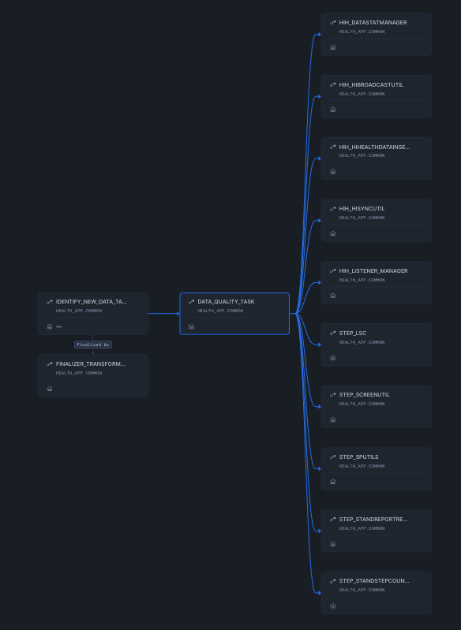

# HealthApp

Pipeline de traitement et d'analyse de logs avec intégration Snowflake.



## 📋 Description

HealthApp collecte et traite des logs applicatifs :
- Ingestion de logs depuis diverses sources
- Transformation et nettoyage des données
- Chargement dans Snowflake pour stockage et analyse

## 🚀 Prérequis

### Compte Snowflake
- Compte actif sur Snowflake

### Outils requis
- Python 3.8+
- Bash shell
- OpenSSL (pour génération des clés)
- Snowflake-CLI

## 🔧 Installation

### 1. Cloner le repository
```bash
git clone https://github.com/Mooncakk/HealthApp.git
cd HealthApp
```

### 2. Installer les dépendances Python
```bash
pip install -r requirements.txt
```

### 3. Configurer les clés RSA pour Snowflake

Générer une paire de clés RSA privée/publique :
```bash
cd connection
openssl genrsa 2048 | openssl pkcs8 -topk8 -inform PEM -out rsa_key.p8 -nocrypt
openssl rsa -in rsa_key.p8 -pubout -out rsa_key.pub
```

### 4. Créer l'utilisateur de service et le rôle dans Snowflake

Connectez-vous à Snowflake et exécutez :

- Création de l'utilisateur de service
```sql
-- Créer l'utilisateur de service
CREATE USER deployment_user
  TYPE = SERVICE;

-- Assigner la clé publique (copier le contenu de rsa_key.pub sans header/footer)
ALTER USER deployment_user SET RSA_PUBLIC_KEY='CONTENU_DE_VOTRE_CLE_PUBLIQUE';
```

- Création du rôle dev_sec_ops_role
```sql
-- Créer le rôle DevSecOps (si il n'existe pas déjà)
CREATE ROLE IF NOT EXISTS dev_sec_ops_role;

-- Accorder les privilèges de création au niveau du compte
GRANT CREATE WAREHOUSE ON ACCOUNT TO ROLE dev_sec_ops_role;
GRANT CREATE DATABASE ON ACCOUNT TO ROLE dev_sec_ops_role;
GRANT CREATE USER ON ACCOUNT TO ROLE dev_sec_ops_role;
GRANT CREATE ROLE ON ACCOUNT TO ROLE dev_sec_ops_role;

-- Accorder les privilèges de gestion des accès
GRANT MANAGE GRANTS ON ACCOUNT TO ROLE dev_sec_ops_role;

-- Accorder le privilège d'exécution des tâches (avec option de délégation)
GRANT EXECUTE TASK ON ACCOUNT TO ROLE dev_sec_ops_role WITH GRANT OPTION;

-- Assigner le rôle au compte de service deployment_user
GRANT ROLE dev_sec_ops_role TO USER deployment_user;
```

### 5. Configurer les variables d'environnement

```bash
# Account locator Snowflake (format: XXXXXXX)
export SNOWFLAKE_ACCOUNT='votre-account-locator'

```

💡 **Tip**: Pour rendre ces variables permanentes :
```bash
echo 'export SNOWFLAKE_ACCOUNT="votre-account-locator"' >> ~/.bashrc
source ~/.bashrc
```

## ▶️ Lancement

### Exécution complète du pipeline
```bash
./main_script.sh
```

Le script effectue automatiquement :
1. Validation des variables d'environnement
2. Connexion à Snowflake via l'utilisateur de service
3. Ingestion et traitement des logs
4. Transformation via requêtes SQL

### Exécution de scripts individuels

Pour tester un composant spécifique :
```bash
python scripts/votre_script.py
```

## 📁 Structure du projet

```
HealthApp/
├── connection/        # Configuration connexions et clés SSH
├── dataset/          # Logs sources et données brutes
├── scripts/          # Scripts Python de traitement des logs
├── sql/              # Requêtes SQL de transformation
├── main_script.sh    # Script principal d'orchestration
├── requirements.txt  # Dépendances Python
└── README.md         # Cette documentation
```

## 🔍 Vérification

Après l'exécution, vérifiez dans Snowflake :
```sql
-- Lister les bases de données créées
SHOW DATABASES;

-- Vérifier les tables de logs
USE DATABASE votre_database;
SHOW TABLES;

-- Exemple de requête sur les logs
SELECT * FROM logs_table LIMIT 10;
```

## 🐛 Dépannage

### Erreur de connexion Snowflake
- Vérifiez les variables d'environnement : `echo $SNOWFLAKE_ACCOUNT`
- Confirmez que la clé publique est correctement assignée à l'utilisateur de service

### Erreur de permission
- Assurez-vous que `deployment_user` a le type SERVICE
- Vérifiez les privilèges sur les bases de données

### Script ne s'exécute pas
- Rendez le script exécutable : `chmod +x main_script.sh`
- Consultez l'historique des requêtes sur Snowflake pour identifier l'étape problématique

## 📝 Notes de sécurité

⚠️ **Important** :
- Ne commitez JAMAIS vos clés privées ou mots de passe
- Ajoutez `connection/rsa_key.p8` et `.env` au `.gitignore`
- L'utilisateur de service doit avoir les privilèges minimums nécessaires
